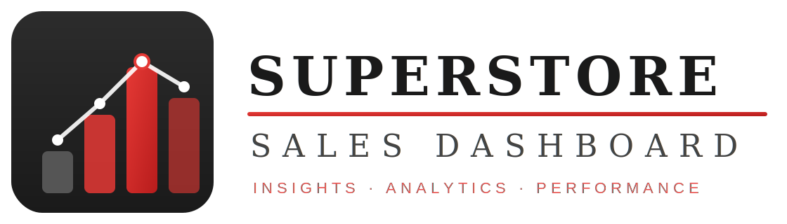
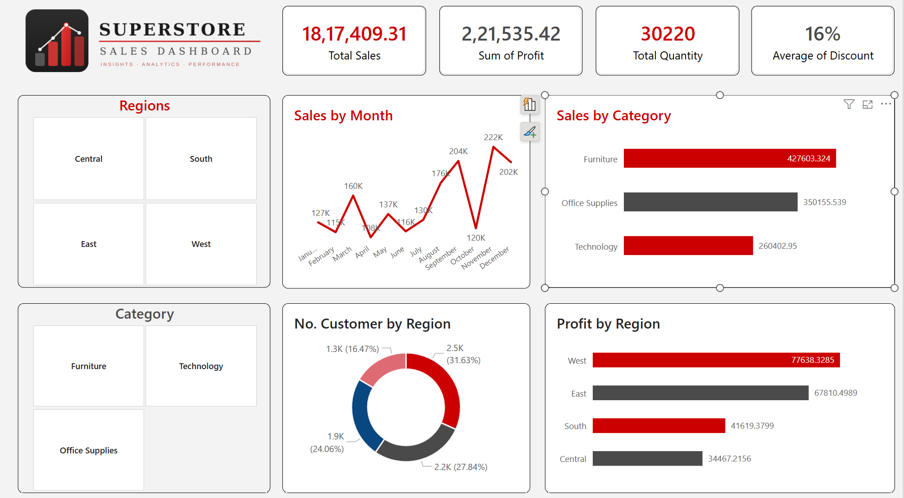

<div align="center">



# 🏪 Superstore Sales Dashboard

### *An Interactive Business Intelligence Solution Built with Microsoft Power BI*

[](https://powerbi.microsoft.com/)
[](https://www.microsoft.com/en-us/microsoft-365/excel)

[]()

---

*Insights · Analytics · Performance*

</div>

---

## 📌 Table of Contents

- [Project Overview](#-project-overview)
- [Dashboard Preview](#-dashboard-preview)
- [Key Metrics & KPIs](#-key-metrics--kpis)
- [Dashboard Components](#-dashboard-components)
- [Dataset Description](#-dataset-description)
- [File Structure](#-file-structure)
- [Tools & Technologies](#-tools--technologies)
- [How to Use](#-how-to-use)
- [Insights & Findings](#-insights--findings)
- [Author](#-author)

---

## 📊 Project Overview

The **Superstore Sales Dashboard** is a comprehensive business intelligence solution developed using **Microsoft Power BI**. It transforms raw transactional retail data from the popular Superstore dataset into an actionable, interactive visual analytics experience.

This dashboard is designed to help business stakeholders — from sales managers to C-suite executives — quickly understand performance across **regions, product categories, customer segments**, and **time periods**, enabling faster and more data-driven decisions.

### 🎯 Objectives

| Objective | Description |
|-----------|-------------|
| **Sales Performance Monitoring** | Track total revenue and identify top-performing periods |
| **Profitability Analysis** | Measure profit by region and category |
| **Customer Insights** | Understand customer distribution across regions |
| **Category Intelligence** | Compare sales performance across Furniture, Technology, and Office Supplies |
| **Trend Analysis** | Visualize monthly sales trends to detect seasonality |

---

## 🖼 Dashboard Preview

<div align="center">

> **Full Interactive Dashboard**



*The dashboard features interactive slicers for Region and Category, enabling dynamic cross-filtering across all visuals.*

</div>

---

## 📈 Key Metrics & KPIs

The dashboard header presents four high-level KPIs at a glance:

| KPI | Value | Description |
|-----|-------|-------------|
| 💰 **Total Sales** | **₹18,17,409.31** | Aggregate revenue across all orders |
| 📦 **Sum of Profit** | **₹2,21,535.42** | Total net profit after discounts and costs |
| 🛒 **Total Quantity** | **30,220 units** | Total number of items sold |
| 🏷️ **Average Discount** | **16%** | Mean discount applied across all transactions |

---

## 🧩 Dashboard Components

The dashboard is divided into **six interactive visual panels**:

### 1. 🗺️ Regions Slicer
A **quadrant-style region selector** allowing users to filter the entire dashboard by:
- **Central**
- **South**
- **East**
- **West**

### 2. 📅 Sales by Month (Line Chart)
A time-series line chart displaying monthly sales trends across the full year:

| Month | Sales |
|-------|-------|
| January | 127K |
| February | 115K |
| March | 160K |
| April | 118K |
| May | 137K |
| June | 116K |
| July | 130K |
| August | 176K |
| September | 204K |
| October | 120K |
| November | 222K *(Peak)* |
| December | 202K |

> 📌 **November** records the **highest sales**, suggesting strong year-end buying patterns.

### 3. 🏷️ Category Slicer
An interactive filter panel for product categories:
- **Furniture**
- **Technology**
- **Office Supplies**

### 4. 📊 Sales by Category (Horizontal Bar Chart)
Comparative sales breakdown across the three product lines:

| Category | Total Sales |
|----------|-------------|
| 🪑 Furniture | $427,603.32 *(Highest)* |
| 📎 Office Supplies | $350,155.54 |
| 💻 Technology | $260,402.95 |

### 5. 🍩 No. of Customers by Region (Donut Chart)
Customer distribution across the four US regions:

| Region | Customers | Share |
|--------|-----------|-------|
| West | 2.5K | 31.63% *(Largest)* |
| Central | 2.2K | 27.84% |
| South | 1.9K | 24.06% |
| East | 1.3K | 16.47% |

### 6. 💹 Profit by Region (Horizontal Bar Chart)
Net profit contribution from each geographic region:

| Region | Profit |
|--------|--------|
| 🥇 West | $77,638.33 |
| 🥈 East | $67,810.50 |
| 🥉 South | $41,619.38 |
| 4️⃣ Central | $34,467.22 |

---

## 🗃️ Dataset Description

**Source File:** `Sample - Superstore.xlsx`

The dataset contains **retail transactional data** from a fictional US-based superstore. It includes **9,994 rows** of order-level records spanning **2014–2017**.

### 📋 Data Schema

| Column | Data Type | Description |
|--------|-----------|-------------|
| `Row ID` | Integer | Unique row identifier |
| `Order ID` | String | Unique order reference |
| `Order Date` | Date | Date the order was placed |
| `Ship Date` | Date | Date the order was shipped |
| `Ship Mode` | String | Shipping method (Standard, Second, First, Same Day) |
| `Customer ID` | String | Unique customer identifier |
| `Customer Name` | String | Full name of the customer |
| `Segment` | String | Customer segment (Consumer, Corporate, Home Office) |
| `Country` | String | Country of order (United States) |
| `City` | String | City of delivery |
| `State` | String | State of delivery |
| `Postal Code` | Integer | Delivery postal code |
| `Region` | String | Geographic region (West, East, Central, South) |
| `Product ID` | String | Unique product identifier |
| `Category` | String | Product category (Furniture, Office Supplies, Technology) |
| `Sub-Category` | String | Product sub-category (17 types) |
| `Product Name` | String | Full product name |
| `Sales` | Decimal | Revenue from the transaction |
| `Quantity` | Integer | Number of units ordered |
| `Discount` | Decimal | Discount applied (0.0 to 0.8) |
| `Profit` | Decimal | Profit from the transaction (can be negative) |

### 📦 Sub-Categories Covered
`Bookcases` · `Chairs` · `Labels` · `Tables` · `Storage` · `Furnishings` · `Art` · `Phones` · `Binders` · `Appliances` · `Paper` · `Accessories` · `Envelopes` · `Fasteners` · `Supplies` · `Machines` · `Copiers`

---

## 📁 File Structure

```
Superstore PowerBI/
│
├── 📊 Superstore_Sales_Dashboard.pbix     # Main Power BI project file
├── 📂 Sample - Superstore.xlsx            # Primary data source (Excel format)
├── 📂 Sample - Superstore.csv             # Data source (CSV format)
├── 🖼️  Dashboard.png                      # Dashboard screenshot / preview image
└── 🖼️  superstore_sales_dashboard_logo.png # Project logo asset
```

> 💡 **Note:** To open the `.pbix` file, you need **Microsoft Power BI Desktop** installed on your machine (free download available at [powerbi.microsoft.com](https://powerbi.microsoft.com/desktop/)).

---

## 🛠️ Tools & Technologies

| Tool | Version | Purpose |
|------|---------|---------|
| **Microsoft Power BI Desktop** | Latest | Dashboard development & visualization |
| **Microsoft Excel** | Office 365 | Data source & preprocessing |
| **DAX (Data Analysis Expressions)** | — | Custom measures and calculated columns |
| **Power Query (M Language)** | — | Data transformation & ETL |

---

## 🚀 How to Use

### Prerequisites
- ✅ [Microsoft Power BI Desktop](https://powerbi.microsoft.com/desktop/) installed (free)
- ✅ Git installed (optional, for cloning)

### Steps

**1. Clone the Repository**
```bash
git clone https://github.com/<your-username>/superstore-sales-dashboard.git
cd superstore-sales-dashboard
```

**2. Open the Power BI File**
```
Double-click: Superstore_Sales_Dashboard.pbix
```
Or open Power BI Desktop → **File → Open Report → Browse** → select the `.pbix` file.

**3. Refresh the Data Source** *(if prompted)*
- Go to **Home → Transform Data → Data Source Settings**
- Update the file path to point to `Sample - Superstore.xlsx` on your local machine
- Click **Refresh**

**4. Interact with the Dashboard**
- Use the **Region** slicer (top-left) to filter by geography
- Use the **Category** slicer (bottom-left) to filter by product type
- Click on any chart element to **cross-filter** all other visuals
- Hover over data points for **detailed tooltips**

---

## 💡 Insights & Findings

Based on the dashboard analysis, here are the key business takeaways:

1. **📈 Seasonal Peaks:** Sales spike significantly in **November and December**, indicating strong holiday/year-end purchasing — ideal for targeted marketing campaigns.

2. **🪑 Furniture Leads in Revenue:** Despite being the highest revenue category ($427K), profitability should be further investigated, as heavy discounting (up to 45–80%) was observed in the raw data.

3. **🌍 West Region Dominates:** Both in customer count (31.63%) and profit contribution ($77.6K), the **West region** is the strongest performer.

4. **⚠️ Central Region Underperforms:** With the lowest profit ($34.5K) despite the second-largest customer base (27.84%), the Central region may have margin or operational issues worth investigating.

5. **📉 Discount Impact on Profit:** Several transactions in the dataset show **negative profit** due to discounts of 50–80%, suggesting a need for a tighter discount policy.

6. **💻 Technology — High Margin Opportunity:** Although lowest in volume sales, Technology products likely carry higher margins and warrant strategic investment.

---

## 👤 Author

<div align="center">

**Developed by Devan Patel**

[](https://linkedin.com/in/your-profile)
[](https://github.com/your-username)
[](https://your-portfolio.com)

</div>

---


---

<div align="center">

*If you found this project helpful, please consider giving it a ⭐ star on GitHub!*

**Made Microsoft Power BI**

</div>